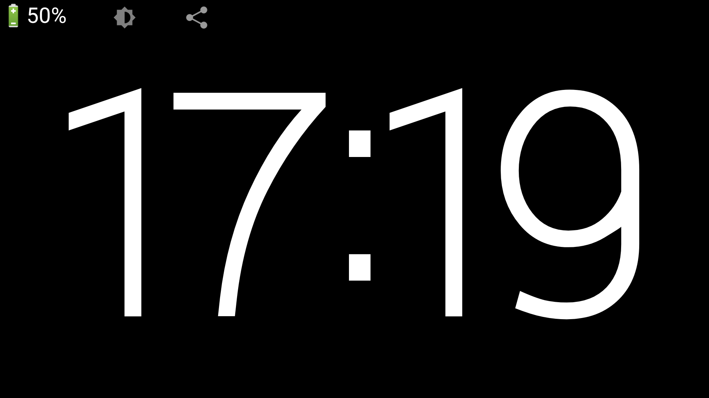
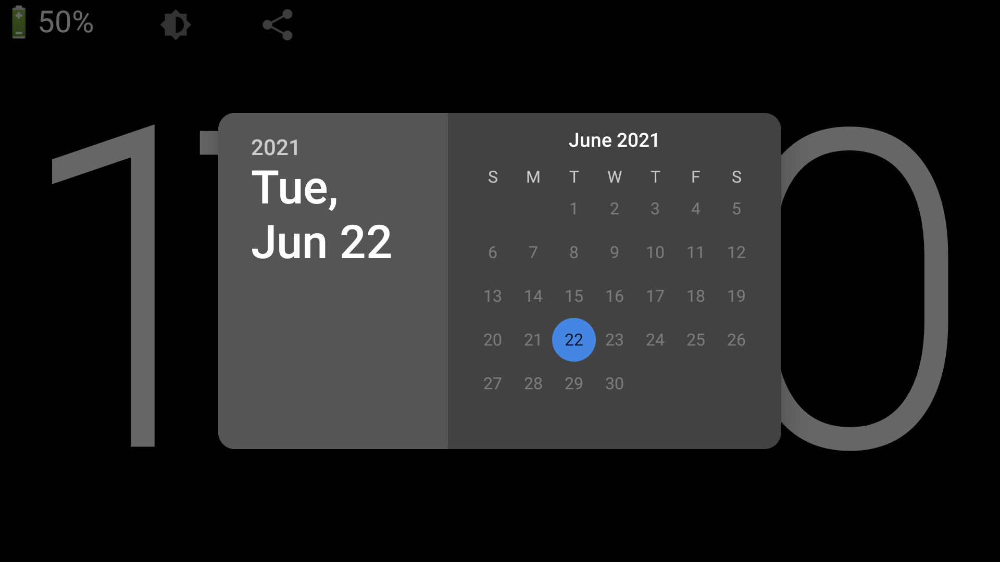
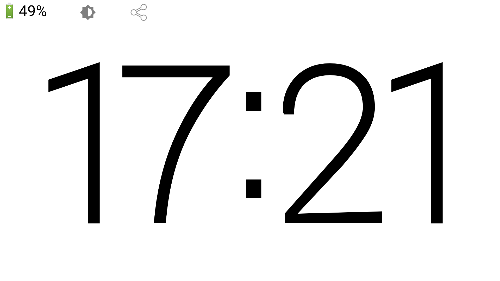

# ClockScreen

Let your waste Android device become a simple digital clock.

## Screenshots

## Build with [AndResGuard](https://github.com/shwenzhang/AndResGuard)

* Modify `signInfo_example.properties` and rename it to `signInfo.properties`

* Execute gradle task: `resguardRelease`